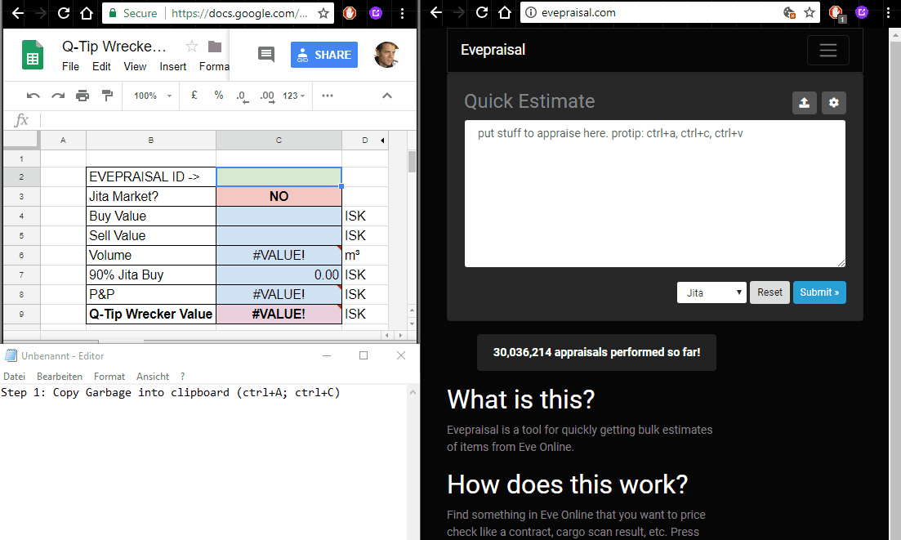

# Buyback Program
This page will guide you on a step-by-step process to submit corporation contracts so you can sell your loot to our corp without hassle.

## LINKS
* [Home](README.md)
* [Buyback Program](Buyback.md)
* [Indy](Indy.md)
* [PI](PI.md)
* [PVE](PVE.md)
* [Jump Freight Services](JumpFreight.md)
* [Human Resources](HumanResources.md)
* [Bylaws](Bylaws.md)

## IMPORTANT NOTE
We ask you not to mix ORE and Minerals with other stuff that you want to sell.
ORE and Minerals must be placed under an independent Coporation contract to be valid and accepted.
There are two reasons for that:
1. Uncompressed Ore has a slightly different buy back process (the reason for that is that the hauling cost to Jita should not be accounted for in the Ore buyback, otherwise it will yield negative value for those selling their stuff);
2. The might want to use a different wallet division to perform the Ore and Minerals buyback.

## PRICE EVALUATION
1. Open your Item Hangar
2. Switch your "Item Hangar" to a "Detailed View" mode AND select the items you want to sell.
3. Copy the selected items from you "Item Hangar".
4. Go to [Evepraisal.com](https://evepraisal.com/).
5. Paste the selected items in the Quick Estimate window using Jita as the market and submit your query.
6. Copy the generated key (EVEPRAISAL ID) for your query located on your browser's address bar.
7. Open the [Q-Tip Spreadsheet](https://docs.google.com/spreadsheets/d/1CsxyZ_1JfQ4zPc4m4qY5Yl1OdcFc0vGr_zBPANfXjAo/edit?usp=sharing)
8. Paste the EVEPRAISAL ID in the spreadsheet (and wait for the magic to happen)

## CONTRACT SET-UP (ORE and MINERALS Only)
1. Use the **90% Jita Buy Price** from the [Q-Tip Spreadsheet](https://docs.google.com/spreadsheets/d/1CsxyZ_1JfQ4zPc4m4qY5Yl1OdcFc0vGr_zBPANfXjAo/edit?usp=sharing) as the value for your contract.
2. Create a Contract using the following options:
**Contract Type** - Item Exchange

**Availablity** - Private

**Name** - INFLUENCE EMPORIUM

**I Will Receive** - "90% Jita Buy Price" from the [Q-Tip Spreadsheet](https://docs.google.com/spreadsheets/d/1CsxyZ_1JfQ4zPc4m4qY5Yl1OdcFc0vGr_zBPANfXjAo/edit?usp=sharing).

**Expiration** - 1 Week

**Description** - Buyback Program - "EVEPRAISAL ID"

**NOTE:** On the description use the EVEPRAISAL ID that you pasted in the Q-Tip spreadsheet, example: "ORE Buyback Program - huh8f"

## CONTRACT SET-UP (NON-ORE)
1. Use the **Q-Tip Wrecker Value** as the value for your contract.
2. Create a Contract using the following options:
**Contract Type** - Item Exchange

**Availablity** - Private

**Name** - INFLUENCE EMPORIUM

**I Will Receive** - Q-Tip Wrecker Value from the [Q-Tip Spreadsheet](https://docs.google.com/spreadsheets/d/1CsxyZ_1JfQ4zPc4m4qY5Yl1OdcFc0vGr_zBPANfXjAo/edit?usp=sharing).

**Expiration** - 1 Week

**Description** - Buyback Program - "EVEPRAISAL ID"

**NOTE:** On the description use the EVEPRAISAL ID that you pasted in the Q-Tip spreadsheet, example: "Buyback Program - huh8f"
